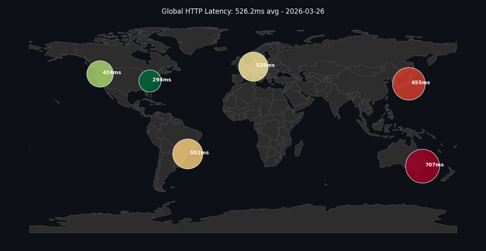

# 🌍 Global Latency Monitor

Automated global latency monitoring system that measures HTTP response times from AWS servers across multiple regions using GitHub Actions.

## Overview

This repository runs a Python monitoring script every 6 hours to measure network latency and health across the following regions:

- US East (N. Virginia)
- US West (Oregon)
- EU Central (Frankfurt)
- Asia Pacific (Tokyo)
- South America (São Paulo)
- Australia (Sydney)

## Features

- **Automated Monitoring**: Runs every 6 hours via GitHub Actions
- **Visual Reports**: Generates geo-mapped latency visualization
- **Dynamic Commit Strategy**: Adjusts commit frequency based on network stability
- **Docker Support**: Containerized Python environment for consistency

## Current Network Status



_Last updated: Automated via GitHub Actions_

## Requirements

- Python 3.9+
- Dependencies: requests, pandas, geopandas, matplotlib, shapely
- Docker (optional, for containerized execution)

## Usage

### Local Execution

```bash
pip install -r requirements.txt
python monitor.py
```

### Docker Execution

```bash
docker build -t latency-bot .
docker run --rm latency-bot
```

## Configuration

Edit the servers list in monitor.py to monitor different regions or endpoints.

## License

MIT
